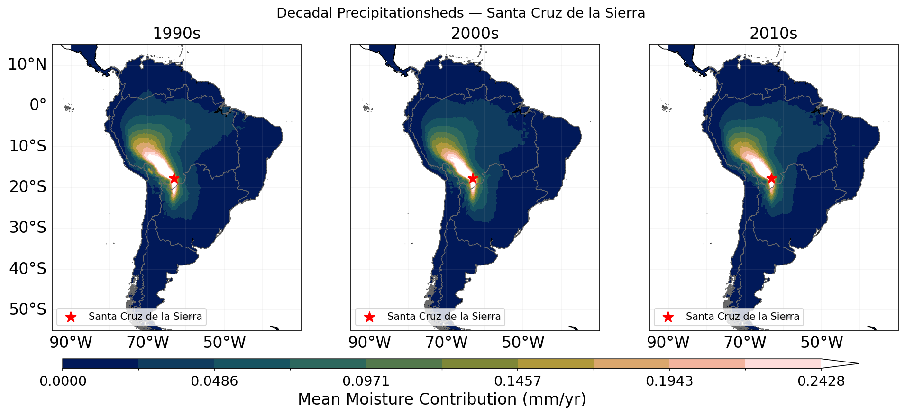
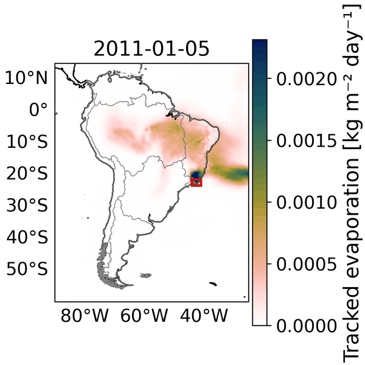

# AguaTrack-ARCO-SA Tutorial

[](LICENSE)
[](pyproject.toml)
[](https://huggingface.co/datasets/AguaTrack/AguaTrack-ARCO-SA)
[](https://doi.org/10.57967/hf/8650)

Companion code release for the **AguaTrack-ARCO-SA** dataset — WAM2Layers
(v3.3.1) backward moisture-tracking output over South America at 0.25°
daily resolution, 1990–2019. The dataset is published on HuggingFace at
[`AguaTrack/AguaTrack-ARCO-SA`](https://huggingface.co/datasets/AguaTrack/AguaTrack-ARCO-SA)
and answers, for any tagged grid cell:
*"where did the rain that fell here today evaporate from?"*



*Three-decade climatology of the moisture sources that feed Santa Cruz,
Bolivia (notebook 02). The warm pixels mark where the rain originally
evaporated; the long tail extending into the Amazon basin is the
"aerial river".*

<p align="center">
  
</p>

*Daily evolution of the tracked-moisture source field around the Serra
do Mar 2011 flash-flood event (notebook 01). Watch the source plume
shift westward over the 18-day window as the storm matures.*

This repository hosts five Colab-runnable Jupyter notebooks that reproduce
the science figures in the data paper. Each notebook is self-contained —
open the Colab link in its row, run all cells, and you get the figure.

## Notebook index

| # | Story | Region | Open in Colab |
|---|---|---|---|
| 00 | Setup and dataset primer | — | [open](https://colab.research.google.com/github/NTU-CompHydroMet-Lab/AguaTrack-ARCO-SA-Tutorial/blob/main/notebooks/00_setup_and_data.ipynb) |
| 01 | Serra do Mar 2011 flash-flood event | SE Brazil | [open](https://colab.research.google.com/github/NTU-CompHydroMet-Lab/AguaTrack-ARCO-SA-Tutorial/blob/main/notebooks/01_event_serra_do_mar_2011.ipynb) |
| 02 | The "aerial river" feeding Santa Cruz | Bolivia (Amazon source) | [open](https://colab.research.google.com/github/NTU-CompHydroMet-Lab/AguaTrack-ARCO-SA-Tutorial/blob/main/notebooks/02_aerial_river_santa_cruz.ipynb) |
| 03 | ENSO-phase composites of moisture sources | Central Chile | [open](https://colab.research.google.com/github/NTU-CompHydroMet-Lab/AguaTrack-ARCO-SA-Tutorial/blob/main/notebooks/03_enso_composites.ipynb) |
| 04 | Central-Chile megadrought decade | Central Chile | [open](https://colab.research.google.com/github/NTU-CompHydroMet-Lab/AguaTrack-ARCO-SA-Tutorial/blob/main/notebooks/04_megadrought_central_chile.ipynb) |

## Getting started

### On Google Colab

Click any "open" link in the table above. Step 1 of each notebook is a
"Configuration" cell holding the HuggingFace zarr URLs and any region /
year constants you might want to edit. Step 2 installs the geo stack
(Colab only). Steps 3+ run the analysis.

### Locally with `uv`

```bash
git clone https://github.com/NTU-CompHydroMet-Lab/AguaTrack-ARCO-SA-Tutorial.git
cd <REPO>
uv sync
uv run jupyter lab
```

For local zarr archives on disk, replace the `hf://datasets/...` URLs
in each notebook's Step 1 cell with filesystem paths and drop the
`storage_options={"revision": ...}` argument.

## Repository layout

```
.
├── notebooks/                  # Colab-runnable tutorials (one per story)
│   ├── 00_setup_and_data.ipynb
│   ├── 01_event_serra_do_mar_2011.ipynb
│   ├── 02_aerial_river_santa_cruz.ipynb
│   ├── 03_enso_composites.ipynb
│   └── 04_megadrought_central_chile.ipynb
├── docs/                       # dataset schema documentation
├── tools/                      # build helpers
├── pyproject.toml              # pinned dependency versions
├── CITATION.cff
├── LICENSE
└── README.md
```

## How to cite

**This repository (tutorial / code).** Zenodo DOI is assigned on the
first GitHub release (planned: `v1.0.0`). Once minted, the BibTeX entry
will appear here.

**Dataset.** Cite the AguaTrack-ARCO-SA dataset directly from
HuggingFace — the dataset card has its own canonical citation block:
[`AguaTrack/AguaTrack-ARCO-SA`](https://huggingface.co/datasets/AguaTrack/AguaTrack-ARCO-SA)
([DOI: `10.57967/hf/8650`](https://doi.org/10.57967/hf/8650)). The
monthly and yearly aggregates at
[`AguaTrackSA/AguaTrack-ARCO-SA-Aggregated`](https://huggingface.co/datasets/AguaTrackSA/AguaTrack-ARCO-SA-Aggregated)
are derived from the daily store and share the same DOI.

**Data paper.** In submission. The reference will be added here once it
is accepted.

## License

- **Code** in this repository: [MIT](LICENSE)
- **Data** (the AguaTrack dataset on HuggingFace): CC-BY 4.0

## Dataset documentation

- [`docs/dataset_daily.md`](docs/dataset_daily.md) — daily zarr schema,
  chunk layout, and access-pattern guidance.
- [`docs/dataset_aggregated.md`](docs/dataset_aggregated.md) — monthly
  and yearly aggregate stores (used by notebooks 02–04).
